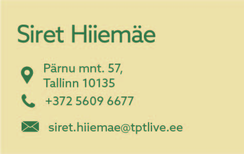

# Stiiliraamatu veebiversioon
 ## Logo Versioonid
 >### Logo esimene versioon
 >
 >**Logo esimene ning peamine versioon, mis on sobilik kasutamiseks enamus andmekandjatel ja suurtel pindadel.**
 >
 >
 >
 >
 >

 >### Logo teine versioon
 >
 >**Logo teine versioon on mõeldud kasutamiseks kitsastel andmekandjatel nagu pastapliiats.**
 >
 >
 >
 >
 >

 >### Logo kolmas versioon
 >
 >**Logo kolmas versioon on kasutusel kõige väiksematel pindadel, juhul kui tekst ei mahu ära.**
 >
 >
 >
 >
 >

 ## Logo selgitus
 
 >**Brief’ist tulenevalt sobib meie klassi iseloomustama panda. Sarnaselt MM20-ga on pandad laisad ning tegutsevad peamiselt öösiti. Enamus tundides näed vaid üksikuid inimesi ning ka nendel on uni veel pooleli ja palju tööd tehtud ei saa.**
 >**Logo on suhteliselt lihtne samamoodi nagu MM20 õpilased.**

 ## Logo turvaruum

 >**Logo turvaruumiks on 20 mm.**
 >
 >**See võiks olla minimaalne kaugus kõigist teistest disainielementidest.**
 >

 ## Värvipalett

 >

  ## Kirjatüübid

 >

 ## Andmekandjad

 >**Visiitkaart**
 >
 >
 >
 >
 >**A4 kirjablankett**
 >
 >

## Mock up-id

>
>

